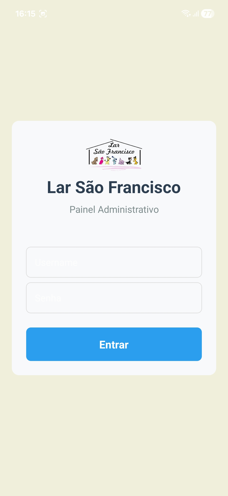
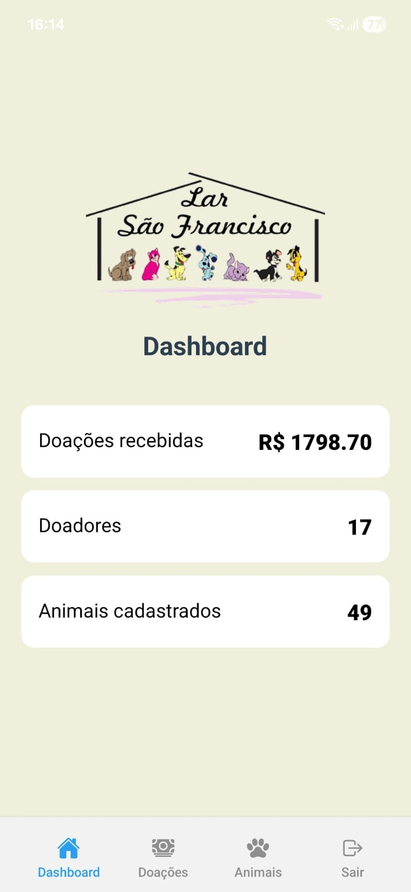
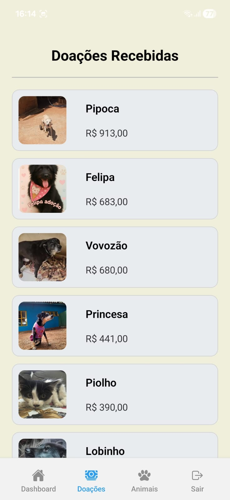
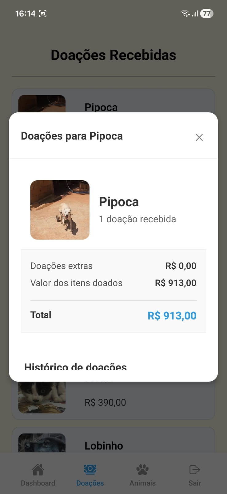
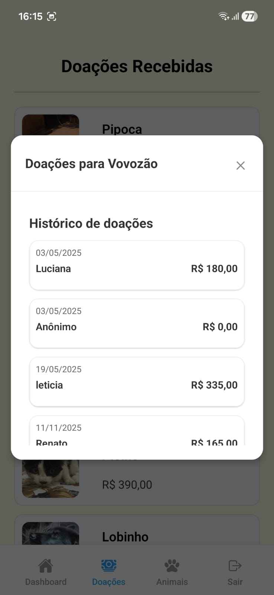
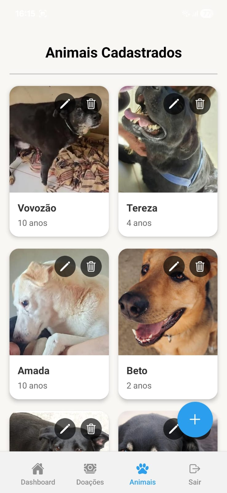
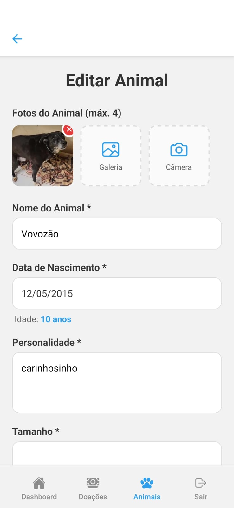

# 🐾 Lar de Acolhimento App

Aplicativo mobile desenvolvido para facilitar a gestão interna de uma ONG de proteção animal, centralizando o controle de animais resgatados, doações recebidas e informações operacionais em uma única plataforma.

O projeto foi criado com foco em organização, produtividade e impacto social.

---

## 📱 Sobre o projeto
O Lar de Acolhimento App nasceu com o objetivo de modernizar a rotina administrativa de uma ONG, substituindo controles manuais e processos descentralizados por uma solução mobile prática e acessível.

Com o app, a equipe consegue acompanhar animais acolhidos, registrar necessidades, acompanhar doações e manter informações sempre atualizadas.

## ✨ Objetivos
- Melhorar a gestão interna da ONG
- Organizar cadastro e acompanhamento de animais
- Centralizar controle de doações recebidas
- Reduzir processos manuais e retrabalho
- Facilitar tomada de decisão com dados organizados

## 🚀 Tecnologias utilizadas
**Mobile:**
- React Native
-  Expo
-  TypeScript
-  Expo Router

**Estado e Requisições:**
- TanStack Query (React Query)
- Axios

**UI / UX:**
- React Native Components
- DateTimePicker
- Expo Image Picker

**Segurança**
- Expo Secure Store

**Backend (consumido via API)**
- REST API
- https://github.com/lucianakyoko/lar-de-acolhimento

## 📸 Funcionalidades
### 🔐 Acesso
- Login autenticado
- Rotas protegidas
- Sessão persistida

### 🐶 Gestão de Animais
- Cadastro de animais resgatados
- Edição de informações
- Upload de imagens
- Deleção de registro
- Controle de status para adoção
- Dados completos

### 🎁 Gestão de Necessidades e Doações
- Cadastro de itens necessários
- Visualização de doações recebidas

### 📋 Organização Operacional
- Informações centralizadas
- Atualização rápida em campo
- Melhor acompanhamento da rotina da ONG

---

## 📱 Screenshots

   
   

   
   
   

   
   

